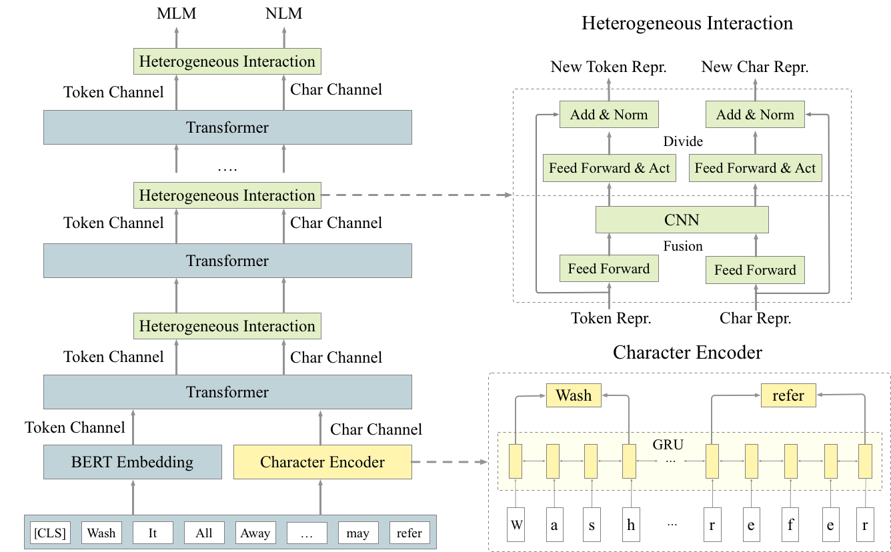

<p align="center">
  <br>
      
  <br>
</p>
 
# CharBERT: Character-aware Pre-trained Language Model 

This repository contains resources of the following [COLING 2020](https://www.coling2020.org) paper.  

**Title: CharBERT: Character-aware Pre-trained Language Model**    
Authors: Wentao Ma, Yiming Cui, Chenglei Si, Ting Liu, Shijin Wang, Guoping Hu   
Link: [https://arxiv.org/abs/2011.01513](https://arxiv.org/abs/2011.01513)



## Models
We primarily provide two models. Here are the download links:   
pre-trained CharBERT based on BERT [charbert-bert-wiki](https://drive.google.com/file/d/1rF5_LbA2qIHuehnNepGmjz4Mu6OqEzYT/view?usp=sharing)    
pre-trained CharBERT based on RoBERTa [charbert-roberta-wiki](https://drive.google.com/file/d/1tkO7_EH1Px7tXRxNDu6lzr_y8b4Q709f/view?usp=sharing)   

## Directory Guide
```
root_directory
    |- modeling    # contains source codes of CharBERT model part
    |- data   # Character attack datasets and the dicts for CharBERT
    |- processors # contains source codes for processing the datasets
    |- shell     # the examples of shell script for training and evaluation
    |- run_*.py  # codes for pre-training or finetuning

```

## Requirements
```
Python 3.6  
Pytorch 1.2
Transformers 2.4.0
```

## Performance

### SQuAD
| Model | 1.1 | 2.0 | 
| :------- | :---------: | :---------: 
| BERT  | 80.5 / 88.5 | 73.7 / 76.3 |
| CharBERT  | 82.9 / 89.9 | 75.7 / 78.6 | 

### Text Classification
| Model | CoLA | MRPC | QQP | QNLI | 
| :------- | :---------: | :---------:| :---------:| :---------: 
| BERT  | 57.4 | 86.7 | 90.6 | 90.7 |
| CharBERT  | 59.1 | 87.8 | 91.0 | 91.7 | 

### Sequence Labeling
| Model | NER | POS |  
| :------- | :---------:| :---------: 
| BERT  | 91.24 | 97.93 | 
| CharBERT  | 91.81 | 98.05 | 

## Robustness

### Evaluation Datasets
We conduct the robustness evaluation on adversarial misspellings followed [Pruthi et al.,2019](https://www.aclweb.org/anthology/P19-1561/).
Those attacks include four kinds of character-level attack: dropping, adding, swapping, keyboard.
For the evaluation tasks, we select SQuAD 2.0, CoNLL2003 NER, and QNLI.
For example, the original example in QNLI:  
```
Question: What came into force after the new constitution was herald?
Sentence: As of that day, the new constitution heralding the Second Republic came into force.
Label: entailment
```

After the attack, the example is:  
```
Question: What capme ino forxe afgter the new constitugion was herapd?
Sentence: As of taht day, the new clnstitution herajlding the Sscond Republuc cae into forcte.
Label: entailment
```
**Please check `data/attack_datasets` folder for these data.**

### Robustness Evaluation (original/attack)

| Model | QNLI | CoNLL2003 NER | SQuAD 2.0 | 
| :------- | :---------: | :---------:| :---------:   
| BERT  | 90.7/63.4 | 91.24/60.79 | 76.3/50.1 |  
| CharBERT  | 91.7/80.1 | 91.81/76.14 | 78.6/56.3 |  

## Usage
You may use another hyper-parameter set to adapt to your computing device, but it may require further tuning, especially `learning_rate` and `num_train_epoch.`

### MLM && NLM Pre-training
```
DATA_DIR=YOUR_DATA_PATH
MODEL_DIR=YOUR_MODEL_PATH/bert_base_cased #initialized by bert_base_cased model
OUTPUT_DIR=YOUR_OUTUT_PATH/mlm
python3 run_lm_finetuning.py \
    --model_type bert \
    --model_name_or_path ${MODEL_DIR} \
    --do_train \
    --do_eval \
    --train_data_file $DATA_DIR/testdata/mlm_pretrain_enwiki.train.t \
    --eval_data_file $DATA_DIR/testdata/mlm_pretrain_enwiki.test.t \
    --term_vocab ${DATA_DIR}/dict/term_vocab \
    --learning_rate 3e-5 \
    --num_train_epochs 2 \
    --mlm_probability 0.10 \
    --input_nraws 1000 \
    --per_gpu_train_batch_size 4 \
    --per_gpu_eval_batch_size 4 \
    --save_steps 10000 \
    --block_size 384 \
    --overwrite_output_dir \
    --mlm \
    --output_dir ${OUTPUT_DIR}

```

### SQuAD
```
MODEL_DIR=YOUR_MODEL_PARH/charbert-bert-pretrain 
SQUAD2_DIR=YOUR_DATA_PATH/squad 
OUTPUT_DIR=YOUR_OUTPUT_PATH/squad 
python run_squad.py \
    --model_type bert \
    --model_name_or_path ${MODEL_DIR} \
    --do_train \
    --do_eval \
    --data_dir $SQUAD2_DIR \
    --train_file $SQUAD2_DIR/train-v1.1.json \
    --predict_file $SQUAD2_DIR/dev-v1.1.json \
    --learning_rate 3e-5 \
    --num_train_epochs 2 \
    --per_gpu_train_batch_size 4 \
    --per_gpu_eval_batch_size 4 \
    --save_steps 2000 \
    --max_seq_length 384 \
    --overwrite_output_dir \
    --doc_stride 128 \
    --output_dir ${OUTPUT_DIR}
```

### NER
```
DATA_DIR=YOUR_DATA_PATH/CoNLL2003/NER-en
MODEL_DIR=YOUR_MODEL_PATH/charbert-bert-wiki
OUTPUT_DIR=YOUR_OUTPUT_PATH/ner
python run_ner.py --data_dir ${DATA_DIR} \
                  --model_type bert \
                  --model_name_or_path $MODEL_DIR \
                  --output_dir ${OUTPUT_DIR} \
                  --num_train_epochs 3 \
                  --learning_rate 3e-5 \
                  --char_vocab ./data/dict/bert_char_vocab \
                  --per_gpu_train_batch_size 6 \
                  --do_train \
                  --do_predict \
                  --overwrite_output_dir
```

## Citation
If you use the data or codes in this repository, please cite our paper.
```
@misc{ma2020charbert,
      title={CharBERT: Character-aware Pre-trained Language Model}, 
      author={Wentao Ma and Yiming Cui and Chenglei Si and Ting Liu and Shijin Wang and Guoping Hu},
      year={2020},
      eprint={2011.01513},
      archivePrefix={arXiv},
      primaryClass={cs.CL}
}
```

## Issues
If there is any problem, please submit a GitHub Issue.
